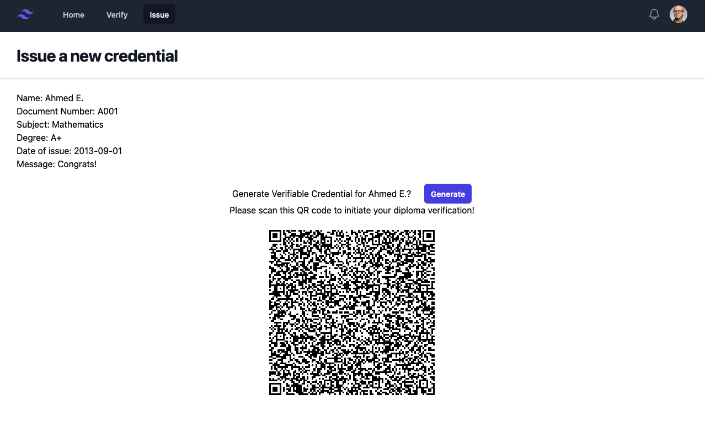
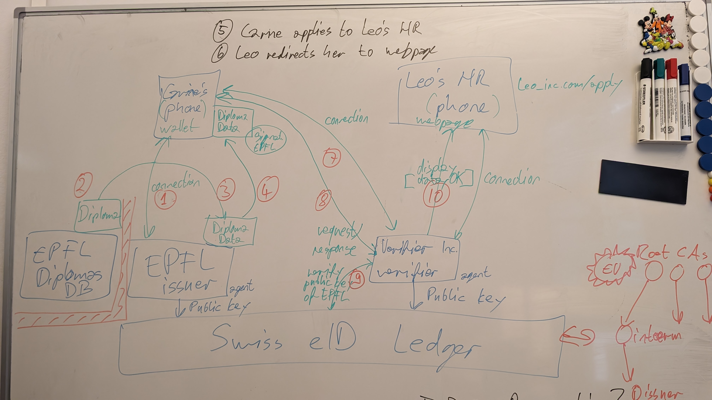
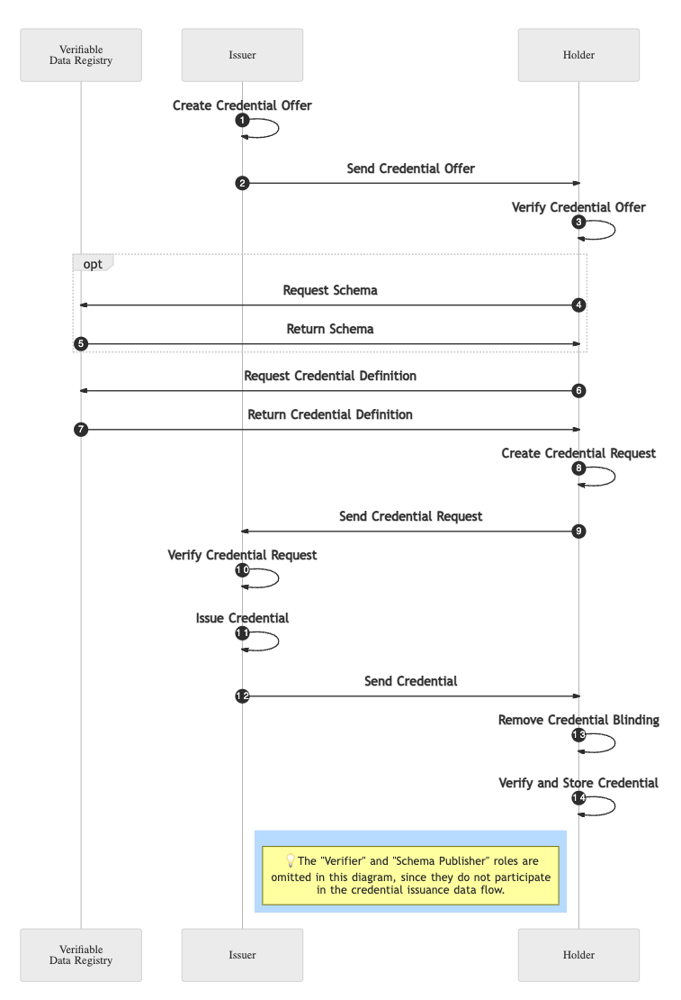

# E-ID demo project
This project implements a simple issuer and verifier for the E-ID protocol.  
It uses the swiss E-ID sandbox ledger which is built over Hyperledger Indy,
and uses Aries Cloud Agent (ACA-Py) as a backend for the issuer and verifier.



## Technical Details and system requirements
### Flow Diagrams


**E-ID issuance flow**


### External dependencies
**Ledger**  
This project uses the [Swiss E-ID sandbox ledger](https://explorer.sandbox.ssi.ch/home/SANDBOX)

**Issuer backend**  
We use a deployed server instance on [aca-py](https://aca-py.org/main/) as the issuer backend.
This instance is currently deployed on C4DT's internal servers which is only viewable from 
within the EPFL network.  
However, this instance can be replaced with any other aca-py instance.  

**Verifier backend**  
A verifier backend is not required for this project, as the verifier is implemented
completely in the frontend.

### Technical dependencies
This project is written in Typescript and uses the [Nuxt framework](https://nuxt.com/).  
It uses [Bun](https://bun.sh/) as a typescript build and runtime tool.

## How To Run
first you need to create a `.env` file in the root directory of the project.  
This file should contain the variables given in the `.env.example` file.

```bash
# To install dependencies
$ bun install
# To run the development server
$ bun --bun run dev
# Build the application for production
$ bun --bun run build
# Locally preview production build
$ bun --bun run preview
```
