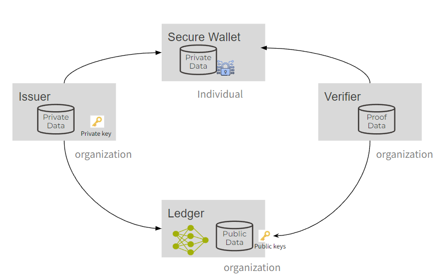
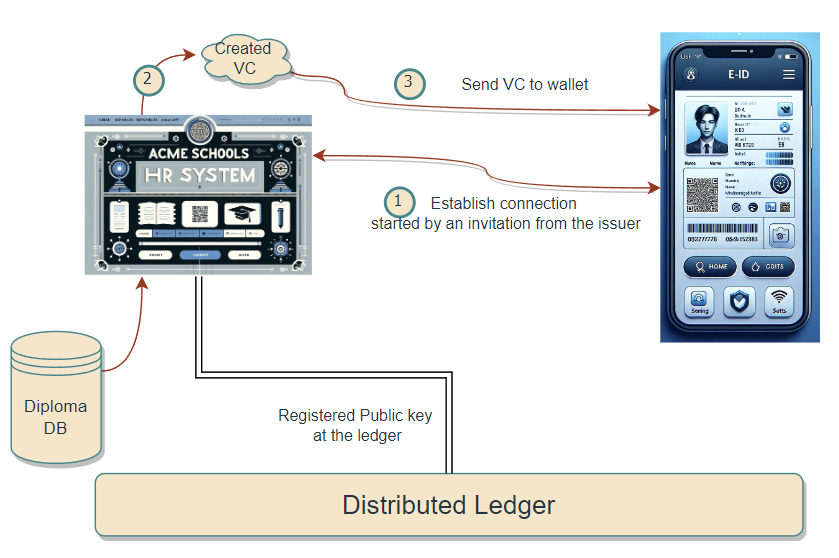
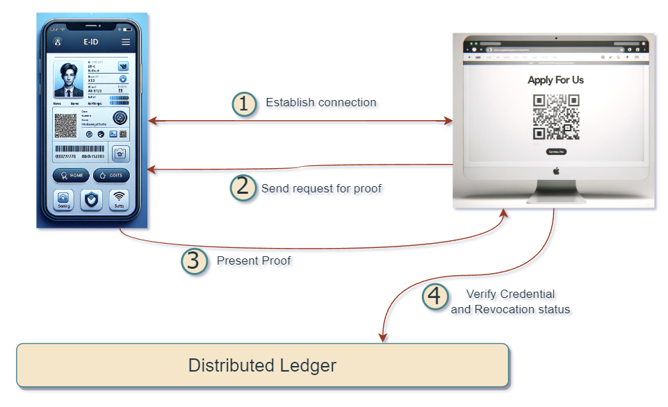

# Switzerland’s Identity on Hyperledger

# Background

In 2021, the Swiss E-ID law proposition was rejected by a public referendum. The reason for that refusal was due to privacy concerns in the implementation and management of that system. Mainly, the idea that the E-ID system was to be developed by a private entity was frowned upon.

Since then, there has been a new proposition in the making. In fact, the FOITT (Federal Office for IT and Telecommunication) has taken an even more pragmatic, and active approach by developing a prototype solution, and gaining approvals of the technical community before settling on a final solution / proposition for the new law.

# C4DT prototype

In late 2023, C4DT wanted to extend our contributions to provide the community with a prototype showing how the E-ID eco-system would look like in the future. At first, the idea was assemble a collection of existing open source tools to build a simplified but complete workflow of the E-ID eco-system. Starting from issuing a new E-ID to storing it in a holder’s wallet to verifying that E-ID. However, it was not that easy, The tools that were expected to follow standards to a high degree seemed to be weak against any type of customization, hence the open source tools were incompatible to a high degree. The resulting prototype ended up using only one open source “Wallet” and the client library that does the E-ID logic “Hyperledger Indy”.

At the end of this Article, you will find links to all the code and tools needed to implement this eco-system and start issuing and/or  verifying “Credentials” yourself. However, first, we need to answer the What, How, and Why of this system.

## What is an E-ID?

Before moving forward, having a concrete definition to work with can makes complex systems a lot easier to tackle.

**E-ID**: is a digitally signed document that contains information about the identity of a person or an organization. This document is signed by a trusted organization, and can be cryptographically verified by other organizations.

There’s many entities that can issue an E-ID (the same organizations that can issue a normal ID). For example, the commune,  the cantonal passport office, or the cantonal traffic office, since an ID, a passport, or even a driver’s license are all documents that can prove your identity.

The nature of the diversity of different ID documents that exist paved the way for the systems that implement solutions for E-IDs to even go one step further and build a single system that can be used for all those ID documents, and more. In fact, a single system can be used to issue and verify any kind of document.

### Enter Verifiable Credentials “VCs”

This could make the term “E-ID” a cause for confusion if we start issuing and verifying school certificates for example. This is why the modern systems that exist today discuss the issue if E-IDs within a larger context called “Verifiable Credentials”.

**Verifiable Credentials**: Digitally signed documents issued to a person or an entity that would prove their claim or the contents of that document. The authenticity of these documents can be verified through cryptographic methods.

## Why is a new system needed?

A digital solution for signing and verifying the authenticity of documents; There has been a ton of solutions for such a system. Some of them built for personal document verification, and some even built to issue government IDs.

In fact, there’s already some apps that are widely used by almost everyone. Think about Google Wallet, or Apple Wallet. These two apps are almost on every phone in USA, and the EU. The main usage is probably for storing a digital replica of your credit card, but it’s also widely used for storing plane tickets, concert tickets, or any other credential that is compatible with these wallets, and could be verified using NFC.
But in fact, there’s plethora of different apps and systems out there for different use cases. Not all of them include a nice wallet app where you can store your documents.
Going for a custom solution implemented by a private company is not bad,  but a good amount of healthy skepticism would leave you worried about the actual privacy guarantees of such a system.

This reason is probably the main issue that got the initial E-ID law proposition to get rejected.
For a public service, proprietary software is not a good solution. Open Source software, and standard protocols are the way to move forward specially if we want to ensure EU and maybe global compatibility in the future.

### Identity rooted on transparency

In late 2022, the prototype for the Swiss E-ID system came out based on Hyperledger Indy, an open source technology maintained by the Hyperledger foundation which is part of the Linux foundation.

Hyperledger Indy is one solution that seeks “Open Source”, and “open Governance”.

Both ideas that are promoted by the transparent nature of how this whole system is implemented. In fact, the whole system can be verified by an active participant of the system. The whole ledger could copied, and always monitored.

The Verifiable Credentials could be stored on any wallet that implements Hyperledger Aries protocols as well. Some of these wallets are open sourced as well giving users a wide variety of wallets to choose from.

Hyperledger Aries is the library that implements all the communication protocols with the Ledger/ Indy, and also with the wallets. It’s also open source, and based on open standards.

## How does this new ecosystem really work?

If you have used any blockchain service before, you probably have noticed some similarities. However I think the similarities come only using the foundation.

**Decentralization of Identity**

This means that the different actors can completely build different software as long as they implement the required protocols.

### **VC actors**

There is four actors in this system

1. **Issuers**

   Entities that issue credentials by signing them. The public key that can be used verify the signed credential, along with the data schema of the data within the credential are send by the issuer and stored on the Ledger.

2. **Verifiers**

   Entities that verify the Verifiable Credentials using the assistance of the information stored on the ledger including the public key of the issuer, the schema of the credential, and any revocation information stored there as well.

3. **Secure Wallet**

   The wallet is an application installed by the user which stores their credentials. It also prepares the credentials and presents them to the verifier using the standard protocols.

4. **Ledger**

   The ledger is the 'trust anchor' of the system. It stores the public keys of the issuers, as well as the schemas and revocation registries. It is the reference used by verifiers to verify the signatures of the credentials. All issuers, and optionally verifiers have to register with the

It’s important to note that the four actors are independent. They only need to follow the standard protocols.

### A deeper dive into the communication between these actors

There is two main scenarios that happen between these actors

We explore both of them using simple diagrams

**Issuing a credential**

In the above diagram, the issuer is on the left represented by an HR system for a school. This is a typical example for a school issuing credentials to a student’s wallet.

**Verifying a credential**

Verification is very similar to issuance, and the verifier here could be any entity that is interested in acquiring information from the wallet holder. In this picture, the verifier is depicted by a website to job posting, where the recruiting platform asks, and verifies automatically the applicant’s diploma and certificates.

## Privacy

Before we conclude this article, I wanted to mention three of the most important features needed in a modern Verifiable Credential system

### Selective Disclosure

If you have shared any signed document before, you probably have always shared the whole document. With Verifiable Credentials, one highly desired feature is sharing specific parts of the document. For example, you might want to share only your age with taking an adult’s only game at Disneyland, or want to only share your name with an online social network.

### Zero-Knowledge proof

Zero-Knowledge proof (ZKP) is a very big and complicated in itself. However, its usage in VCs is straight forward. You will be able to prove a specific condition on some data within your VC without divulging the data itself.

Going back the Disneyland example, with ZKP we can not only show a specific parameter on the ID i.e. age, but we can go one step further, and prove that you’re above a certain age threshold say 13 years old. This will prevent verifier (i.e. Disneyland IT) from knowing your age, but still verify that you’re above required age.

### Unlinkability

This last feature will even achieve a higher degree of privacy preservation. It allows wallet holders to provide their VCs anonymously, or in other words, in a way in which a connection between different usages of the same credential can not be linked together.

In order to understand this more, let’s go back to the Disneyland example. If you ride multiple games that require age verification, Zero-Knowledge proofs will be utilized to hide all your information, but when you use you VC multiple times at different rides, Disneyland will recognize that the age verification from the VC looks exactly the same hence deciding that they’re from the same person. However, unlinkability is a feature that changes the signature every time to prevent the verifying entity from making links between different verifications.

It’s worth noting here that the last point above, unlinkability, is not yet provided by Indy/Aries. However, it’s one of the features of the BBS signature scheme, which might be included in the next E-ID system from FOITT.

### Swiss E-ID sandbox V2

Having described all the important components an VC/ E-ID system, with its important features and actors. Now, we can mention that Hyperledger Indy is not the only solution out there. In fact, the Swiss government might switch to a different system based on the standard [OID4VC](https://openid.net/sg/openid4vc/), but that’s a topic for another article. In any case, all what we’ve discussed in this article are ideas and concepts that will mostly remain the same.

Lastly, we’ve implemented a simple application for both the issuer and verifier. The code is open sourced on Github

Our code: https://github.com/c4dt/eid-demo

In our tests, we used the esatus wallet: [https://play.google.com/store/apps/details?id=com.esatus.wallet](https://play.google.com/store/apps/details?id=com.esatus.wallet&hl=en&gl=US)

And in order to be able to test with the swiss E-ID test ledger, you can read more here:  https://github.com/e-id-admin/public-sandbox-trustinfrastructure